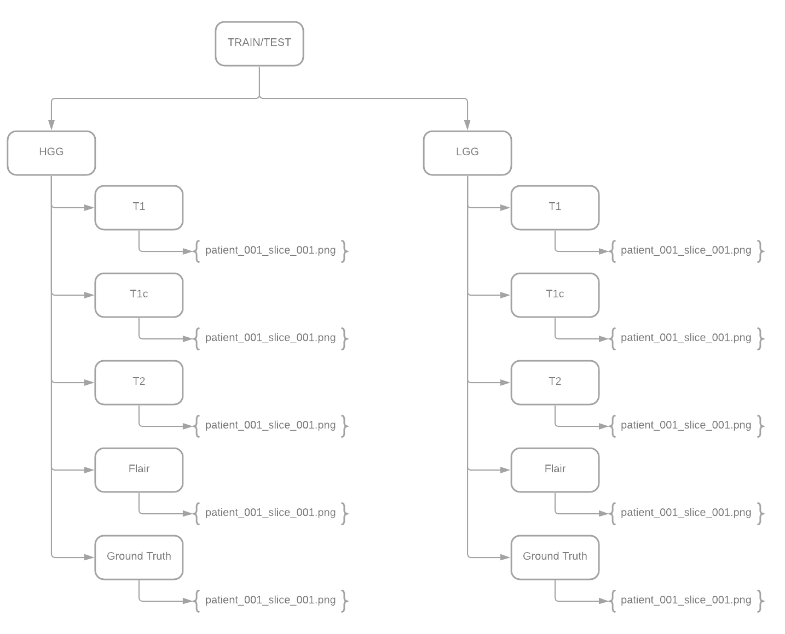

# Processing-Dataset
Scripts to extract and process datasets (Specifically BraTS).

- *input* = root path of dataset (a folder before labels HGG, LGG)
- *output* = a path to put the extracted images. (doesn't need to exist)
- *initial_slice* = from which slice the images should be extracted.
- *final_slice* = until which slice the images shoud be extracted.

The images are organized in the output path as follows:

